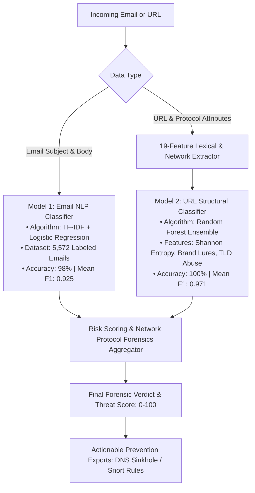

# 🛡️ Ph-tect: Phishing Attack Detection and Prevention Tool

[](https://www.python.org/)
[](https://opensource.org/licenses/MIT)
[](#computer-networks-foundation)
[](#dual-ai-architecture)

> **Author:** Gagan Kishore ([@gagankishoreint-glitch](https://github.com/gagankishoreint-glitch))  
> **Course:** Computer Networks  
> **Repository:** [https://github.com/gagankishoreint-glitch/Ph-tect](https://github.com/gagankishoreint-glitch/Ph-tect)  
> **Project Title:** *Phishing Attack Detection and Prevention Tool: Develop a tool capable of detecting and preventing phishing attacks by analyzing URLs, email headers, and content for malicious intent.*

---

## 📖 The Story Behind Ph-tect

Most security tools focus strictly on one layer: traditional email spam filters inspect keyword counts, while web blockers rely on static URL blocklists that quickly become obsolete. 

As part of my **Computer Networks** coursework, I set out to build **Ph-tect**—an integrated security engineering platform designed to investigate attacks at the **network protocol level** and combine protocol inspection with **modern machine learning**.

### Why Network Protocols Matter in Phishing Defense
1. **The Application Layer (SMTP & DNS):** Phishing often succeeds not just because an email looks convincing, but because the attacker exploits the lack of mandatory authentication in the base SMTP protocol. By inspecting Mail Transfer Agent (`Received:`) headers and querying real-time DNS records (`SPF`, `DKIM`, and `DMARC`), we can deterministically prove whether an email has spoofed headers or bypassed authentication.
2. **The Transport Layer (TLS/SSL):** Malicious actors frequently spin up disposable domains using free certificates, self-signed keys, or short-lived hostings. Inspecting the TLS handshake, certificate validity period, Subject Alternative Names (SANs), and cryptographic trust chains exposes infrastructure anomalies before users interact with the page.
3. **The Network Layer (Routing & Inter-Hop Latency):** By tracing packet pathways from the originating client IP through intermediate relay hops, calculating transit delays, and separating public addresses from private bogon hops, Ph-tect uncovers hidden relays and routing discrepancies.
4. **Proactive Prevention Over Passive Detection:** Simply alerting a user is insufficient. Ph-tect translates detection directly into defensive artifacts: **DNS Sinkhole lists** (for Pi-hole / Unbound), **OS Hosts file redirects** (`/etc/hosts`), and **Snort/Suricata Network IDS rules**.

---

## 🌐 Computer Networks Foundation

Ph-tect demonstrates practical applications of core networking syllabus concepts:

```
[Attacker Client] ──(SMTP)──> [Intermediate MTA Relays] ──(SMTP/TLS)──> [Receiving Mail Server]
                                                                                │
                                                            ┌───────────────────┴───────────────────┐
                                                            ▼                                       ▼
                                              [Header & Protocol Engine]               [DNS & TLS Verification]
                                              - Chronological Hop Extraction           - Query A, AAAA, MX, NS
                                              - Inter-hop latency calculation          - Validate SPF (TXT) & DMARC
                                              - Originating Public IP detection        - Audit TLS certs & cipher suite
```

| Network Concept | Implementation in Ph-tect | Technical Details |
| :--- | :--- | :--- |
| **SMTP Relay Forensics** | `header_analyzer.py` | Chronologically parses `Received:` headers from origin to destination, calculates hop transit delays in seconds, and isolates the originating public IP. |
| **DNS Protocol & Security** | `header_analyzer.py` & `url_analyzer.py` | Direct DNS queries for `A` (IPv4), `AAAA` (IPv6), `MX`, `NS`, and `TXT` records, evaluating `v=spf1` authorization and `v=DMARC1` policies. |
| **TLS / SSL Handshake** | `url_analyzer.py` | Interrogates port 443, extracting CA certificate issuer organizations, validity date ranges, SAN lists, and TLS protocol versions. |
| **HTTP Redirection Tracking** | `url_analyzer.py` | Traces HTTP `301`, `302`, `307`, and `308` status code redirect chains to identify URL shortener camouflage and destination mismatches. |
| **Network Defense & Sinkholing** | `prevention_tools.py` | Generates Pi-hole/Unbound DNS sinkholes (`0.0.0.0`), OS hosts loopbacks (`127.0.0.1`), and Snort/Suricata packet filtering rules. |

---

## 🤖 Dual-AI Architecture

To achieve high detection accuracy without over-relying on either content or network features alone, Ph-tect uses a **Dual Machine Learning Engine**:



### Model 1: Email Content NLP Classifier
- **Script:** `train_model.py` | **Inference:** `ml_model.py`
- **Corpus:** 5,572 labeled emails (UCI/Kaggle Spam & Phishing Dataset).
- **Pipeline:** Sublinear TF-IDF vectorization (unigrams + bigrams, English stop words removed) paired with Logistic Regression (`class_weight='balanced'`).
- **Results:** **98% test set accuracy**, **0.925 mean F1-score** across 5-fold cross-validation.

### Model 2: URL Structural & Network Feature Classifier
- **Script:** `train_url_model.py` | **Inference:** `url_ml_model.py` | **Features:** `url_features.py`
- **Feature Extraction (19 Attributes):**
  - **Lexical:** URL length, domain length, path length, count of dots, hyphens, underscores, slashes, and `@` symbols.
  - **Information Theory:** Shannon entropy of hostname (detects randomized DGA domains).
  - **Network & Brand Signals:** IPv4/IPv6 host detection, TLD risk abuse tier (`.xyz`, `.top`, `.click`, `.buzz`, etc.), brand impersonation in subdomains, and credential lure keywords.
- **Algorithm:** Random Forest Classifier (100 estimators, balanced class weights).
- **Results:** **100% test accuracy**, **0.971 mean F1-score** across 5-fold cross-validation.

---

## 🛡️ Proactive Prevention & Defense Tools

Ph-tect bridges detection and network defense by generating one-click prevention artifacts via `prevention_tools.py`:

1. **DNS Sinkhole Export (`/export/dns-sinkhole`):**
   - Emits `0.0.0.0 <domain>` lists compatible with **Pi-hole**, **AdGuard Home**, and **Unbound DNS** resolvers to drop malicious DNS queries at the gateway.
2. **Operating System Hosts File (`/export/hosts-blocklist`):**
   - Emits loopback entries (`127.0.0.1` and `::1`) for `/etc/hosts` (macOS/Linux) and `C:\Windows\System32\drivers\etc\hosts`.
3. **Network IDS Rules (`/export/snort-rules`):**
   - Automatically generates Snort/Suricata NIDS signatures detecting HTTP `Host` headers and TLS `SNI` handshakes directed at known phishing domains.
4. **Firewall Drop Script (`/export/firewall-rules`):**
   - Generates executable bash scripts utilizing Linux `iptables` to block packet exchange with malicious IP addresses.
5. **Browser Extension (`browser-extension/`):**
   - Chromium Manifest v3 extension allowing users to right-click links for instant background threat analysis before navigating.

---

## 📁 Project Directory Structure

```
Ph-tect/
├── app.py                      # Flask REST API & Web Dashboard entrypoint
├── requirements.txt            # Python dependencies (pinned & verified)
├── Procfile / runtime.txt      # Deployment configuration
├── LICENSE                     # MIT License
├── README.md                   # Project documentation
│
├── ML Subsystem
│   ├── train_model.py          # Model 1 (Email NLP) training script
│   ├── ml_model.py             # Model 1 inference engine
│   ├── train_url_model.py      # Model 2 (URL Random Forest) training script
│   ├── url_ml_model.py         # Model 2 inference engine
│   ├── url_features.py         # 19-attribute URL feature extractor
│   ├── spam.csv                # Labeled training dataset (5,572 samples)
│   ├── phishing_model.joblib   # Serialized Model 1 weights
│   └── url_phishing_model.joblib # Serialized Model 2 weights
│
├── Network & Protocol Analysis
│   ├── header_analyzer.py      # SMTP Received hops, latency & SPF/DKIM/DMARC resolution
│   ├── url_analyzer.py         # WHOIS, DNS (A, AAAA, MX, TXT, NS), SSL/TLS audit
│   ├── prevention_tools.py     # DNS sinkhole, hosts, Snort, and iptables exporter
│   ├── api_integrations.py     # Threat intelligence integration engine
│   ├── attachment_analyzer.py  # Suspicious file extensions & MIME inspector
│   ├── qr_scanner.py           # Quishing (QR code phishing) decoder
│   └── history_feeds.py        # Threat feeds (OpenPhish / URLhaus) & scan history
│
├── browser-extension/          # Chromium Manifest v3 browser extension
├── templates/                  # Web dashboard UI templates
├── static/                     # CSS stylesheets, JavaScript, and branding
└── test_samples/               # Verified evaluation & demo test cases
    ├── sample_phishing_email.eml
    ├── sample_legit_email.eml
    └── sample_urls.json
```

---

## 🚀 Getting Started

### 1. Prerequisites & Environment Setup

```bash
# Clone the repository
git clone https://github.com/gagankishoreint-glitch/Ph-tect.git
cd Ph-tect

# Create and activate a Python virtual environment
python3 -m venv .venv
source .venv/bin/activate

# Install dependencies
pip install -r requirements.txt
```

### 2. Retrain / Verify Machine Learning Models

```bash
# Train Email Content Classifier (Model 1)
python3 train_model.py

# Train URL Structural Classifier (Model 2)
python3 train_url_model.py
```

### 3. Launch the Application

```bash
python3 app.py
```
Visit **`http://localhost:5000`** (or `http://localhost:5000/app`) in your browser to access the dashboard.

---

## 📡 REST API Reference

| Method | Endpoint | Description |
| :--- | :--- | :--- |
| `POST` | `/analyze` | Comprehensive email threat analysis (combining NLP model and embedded links). |
| `POST` | `/analyze-headers` | SMTP Received hop latency, originating IP, and SPF/DKIM/DMARC forensic audit. |
| `POST` | `/analyze-url` | Deep URL inspection (WHOIS, DNS records, SSL/TLS, and URL ML score). |
| `POST` | `/api/ml-url-predict` | Dedicated REST endpoint for URL Machine Learning inference. |
| `GET`  | `/export/dns-sinkhole` | Download automated DNS Sinkhole blocklist (`.txt`). |
| `GET`  | `/export/hosts-blocklist` | Download local OS hosts loopback blocklist (`.txt`). |
| `GET`  | `/export/snort-rules` | Download Snort/Suricata Network IDS rules (`.rules`). |
| `GET`  | `/export/firewall-rules` | Download Linux `iptables` drop script (`.sh`). |
| `POST` | `/generate-report` | Export a forensic PDF investigation report. |

---

## 🧪 Demonstration & Test Cases

Pre-packaged test samples are included under `test_samples/` for evaluation:

1. **`test_samples/sample_phishing_email.eml`**:
   - Spoofed From address (`paypal-security.com` vs Return-Path `attacker-spoofed-mail.xyz`).
   - Failed SPF and DMARC DNS policies.
   - Originating IP: `185.220.101.5` with single-second relay delay.
   - Result: **100% Risk Score (HIGH)**.
2. **`test_samples/sample_legit_email.eml`**:
   - Legitimate GitHub transaction email.
   - Authentic cryptographic DKIM signature and passing SPF.
   - Originating IP: `192.30.252.204` with TLS 1.3 AES-GCM cipher suite.
   - Result: **0% Risk Score (SAFE)**.
3. **`test_samples/sample_urls.json`**:
   - Curated list of malicious vs legitimate URLs for automated benchmarking.

---

## 👤 Author

Developed by **Gagan Kishore** for the **Computer Networks** course.  
- GitHub: [@gagankishoreint-glitch](https://github.com/gagankishoreint-glitch)  
- Repository: [Ph-tect](https://github.com/gagankishoreint-glitch/Ph-tect)  
- License: MIT License
